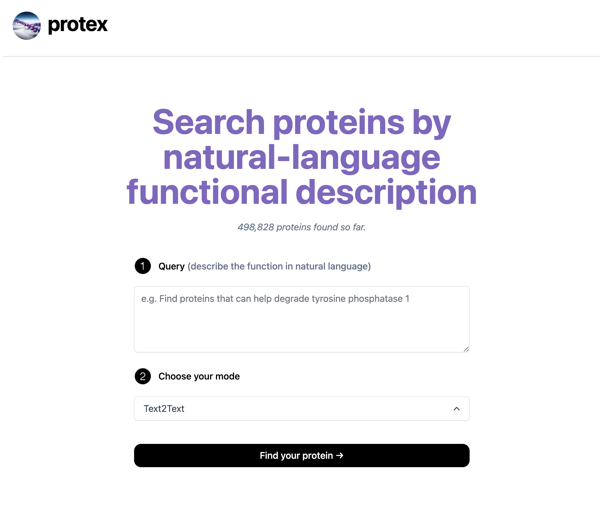

# [protex.app](https://prot2tex-protein-search.vercel.app)

Protex is a semantic search tool enabling researchers to search for both known & novel proteins using natural-language functional description (e.g. "Find proteins that can help degrade tyrosine phosphatase 1")

***Made with: @rdilip, @alexub, @shawndimantha.** 2nd place at Scale AI's Generative AI Hackathon*

## How it works
[**Demonstration Video**](https://youtu.be/m75GaY_1BoE)

**OpenAI's CLIP model** is used to embed both descriptions of proteins (scraped from InterPro) and the embedded protein sequence (obtained using **Meta's ESM embedding model**). Embeddings are stored in **ChromaDB** and a nearest-neighbor vector search is performed to find the most relevant proteins for user queries. 

Our site is built with **React, NextJS, Tailwind CSS, and Flask**.

## How to Use

The frontend is available at [this link](prot2tex-protein-search.vercel.app).

To get the backend running, simply:

1. provide your OpenAI API Key on line 13 of [`protex.py`](https://github.com/ishaanjav/prot2tex-protein-search/blob/807fcaffd99b3d7c11b983386fa8c79cdf904476/protex.py#L13)
2. run `index.py`. *(you might be prompted to install some Python packages)*
3. That's it! 

The website should now be fully functional.
